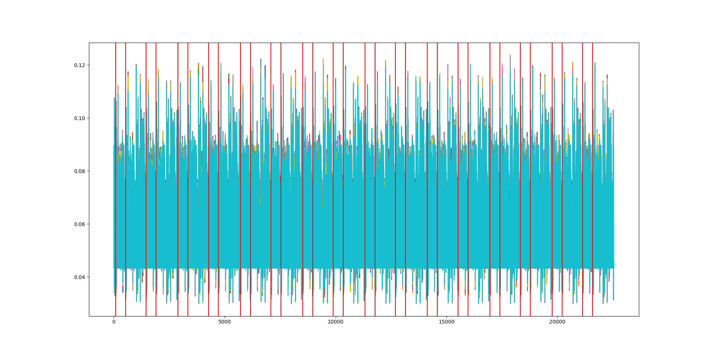
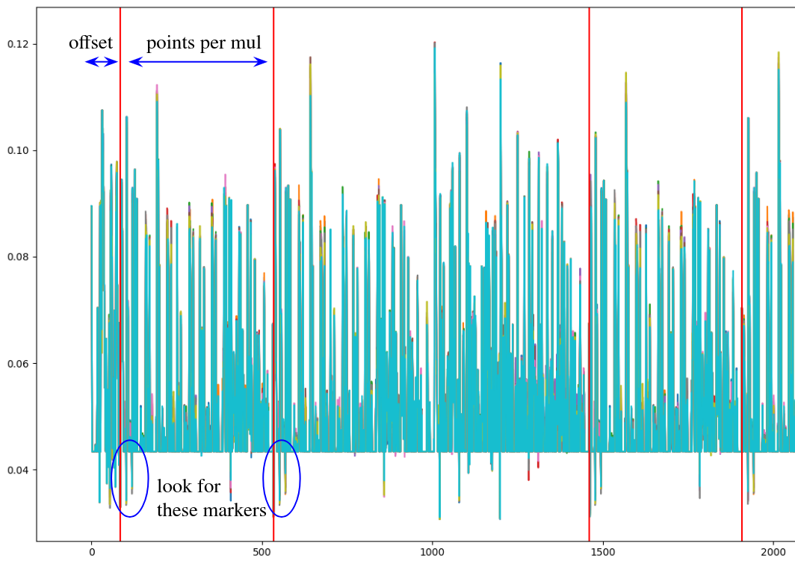

# FalconPowerAnalysis

The goal of this project is to perform Power Analysis on the Falcon signature [scheme](https://falcon-sign.info/).
We use the [ELMO](https://github.com/sca-research/ELMO) simulator to generate power traces, with a python wrapper from [this repository](https://git.aprilas.fr/tfeneuil/python-elmo).
We propose two different attacks.
The Falcon's implementations are taken from [here](https://falcon-sign.info/impl/falcon.h.html) and [here](https://github.com/tprest/falcon.py).

## Preimage Attack

In this attack, we are targeting a polynomial multiplication involving the secret key and the hash of the message.
The two polynomials are in FFT representation and are represented as arrays of coefficients in double precision.

To generate the traces, first set the appropriate value for LOGN in `FalconSimulation/project.c` and then:
```
$ make -C FalconSimulation
$ python3 generate.py --nb-traces=3000 --nb-sets=1 --output-file=traces.hdf5 --logn=4
```

It is possible to append new sets of traces to a preexisting file, but the key of the new sets should be of the same length as the sets already present in the file for consistency. A set consists in a hdf5 group, which contains a hdf5 dataset for each traces. The key is stored in the group attribute and the value of each challenge is stored in the corresponding dataset attribute.

```
$ python3 generate.py --help
usage: generate.py [options]
Options:
 -h --help            display this summary
 --nb-sets val        number of sets to generate
 --nb-traces val      number of traces to generate for each set
 --file file          file where the traces are stored
 -v --verbose         run the generator in verbose mode
 --info               display information about the file
 --remove             reduce sets down to nb-traces
 --expand             expand sets up to nb-traces
 --logn               dimension of key and challenges
```

To check the properties of the sets in a file:

```
$ python3 generate.py --info --input-file=traces.hdf5
```

To perform the attack on the traces:

```
$ python3 analyze.py --help
usage: analyze.py [options]
Options:
 -h --help                      display this summary
 --nb-tests=<value>             number of tests to run on the traces
 --nb-traces=<value>            number of traces to use for each test
 --input-file=<file>             file where the traces are stored
 -v --verbose                   run the attack in verbose mode
 -a --all                       use all available multiplication patterns

$ python3 analyze.py --nb-traces=3000 --nb-tests=10 --input-file=traces.hdf5 -v --all
```

The script will output the number of success. An attack is considered to be a success if all the coefficients of the key have been recovered.


To create noisy traces:

```
$ python3 add_noise.py --input-file=traces.hdf5 --output-file=noisy.hdf5 --noise=0.1
```

Note that this script may not produce the expected results without minor adjustments on the pattern matching and the location of the points of interest.
This script is only provided as a tool to help reproduce the attack on the preimage computation.


You can uncomment lines in the function `run_sca` to plot the pattern matching over the traces.
In dimension 16, this should look like this:


You need to adjust the variables `offset` and `points_per_mul` as shown on the image below.


## Sampler Attack

In this attack, we target the gaussian sampler of Falcon.

To generate the signatures:
```
$ python3 generate.py --nb-sigs=50000 --nb-sets=1 --output-file=sigs.hdf5 --logn=4
```

To check the properties of the sets in a file:

```
$ python3 generate.py --info --input-file=sigs.hdf5
```

To perform the deformed parallelepiped attack on the signatures:

```
$ python3 analyze.py --help
usage: analyze.py [options]
Options:
 -h --help                      display this summary
 --nb-sigs=<value>              number of signatures to use for each test
 --input-file=<file>            file where the signatures are stored
 -v --verbose                   run the attack in verbose mode
 --row=<value>                  recover specific row
 --existing=<file>              use existing vectors as starting point
 --max-desc=<value>             maximum of iterations for a gradient descent

$ make
$ python3 analyze.py --nb-sigs=50000 --nb-tests=1 --input-file=sigs.hdf5 -v
```
Note that this attack is multi-processed by design and will use up all the CPUs available on your machine.


To recover intermediary samples by side channel leakage with ELMO:

```
$ make -C FalconSimulation
$ python3 single_trace.py
```

For convenience, we have modified the Falcon's official implementation for this attack to return the intermediary samples along with the signatures, which allows us to perform the deformed parallelepiped attack without actually performing the single power analysis.
